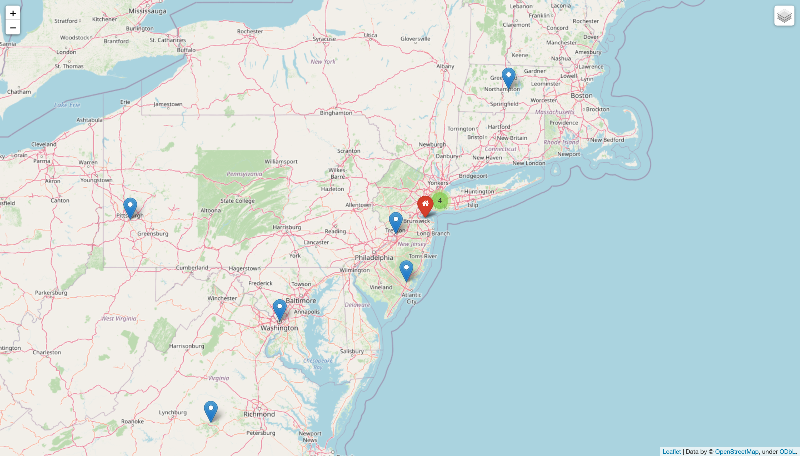

# Film Mapper

Film Mapper is a Python package for analyzing displaying films on a map by year and location.

## Installation

Clone the GitHub repository.

```bash
git clone https://github.com/UCU-programming-tasks/films_mapper_command_line_project.git
```

Install all packages.

```bash
pip3 install -r requirements.txt
```

## Usage

Run the main module.

```bash
python3 main.py
```

Enter necessary information.

```bash
Please enter a year you would like to have a map for: 2016
Please enter your location (format: lat long): 48.922499 25.747161
```

Wait for the map to generate.

```bash
Locations are getting collected...
Map is generating...
Finished. Please have look at the map films_map.html
```

Check the output file (films_map.html).

## Example



You can see your's location and locations of nearby places where different movies were recorded.
Click on marker to see the name of the movie.

## Contributing

Pull requests are welcome. For major changes, please open an issue first to discuss what you would like to change.

Please make sure to update tests as appropriate.

## License

[MIT](https://choosealicense.com/licenses/mit/)
